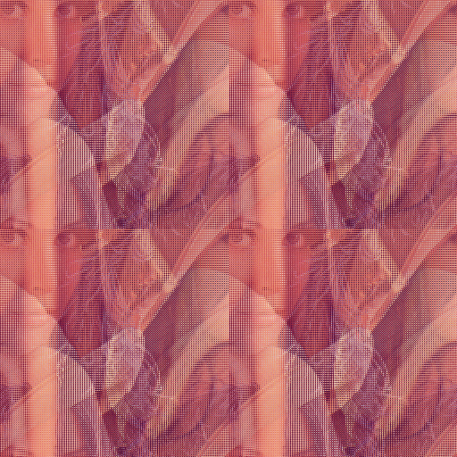

# catlab

<center>
    <abbr title="Original"></abbr>
    <abbr title="Iteration 191"></abbr>
</center>

A pure Go library for working with and analyzing [Arnold-Cat Maps](https://en.wikipedia.org/wiki/Arnold%27s_cat_map)  

### Usage
**Note**: The analysis portion isn't ready yet  
```
$ git clone github.com/kendfss/catlab
$ cd catlab
$ go install [or build]
$ [./]catlab path1 path2 ... pathN
```
- if the path refers to a directory, a random image will be chosen from its subtree (if a [suitable](#supported-extensions) file exists)  
- it will search in the current working directory if no args are given  


### Specs
##### Supported Extensions
- jpeg/jpg  
- png  

